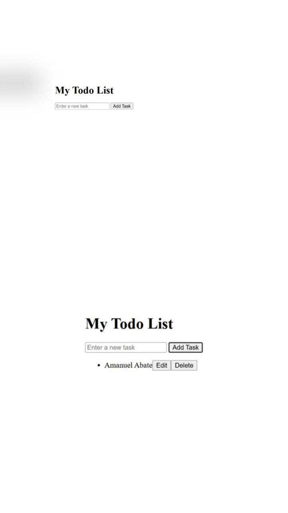

# Simple Todo List App

This is a simple Todo List application built using **HTML** and **JavaScript**.

## Features
- Add new tasks
- Edit existing tasks
- Delete tasks by clicking the delete button

## How to Run
1. Clone or download this repository.
2. Open the `index.html` file in your browser.

## Screenshots
### 🏠 Main Page

### ➕ Add Task

### 📝 Edit Task

### ❌ Delete Task
This screenshot shows the user deleting a task by clicking the "Delete" button.

## Author
Created by Amanuel Abate

